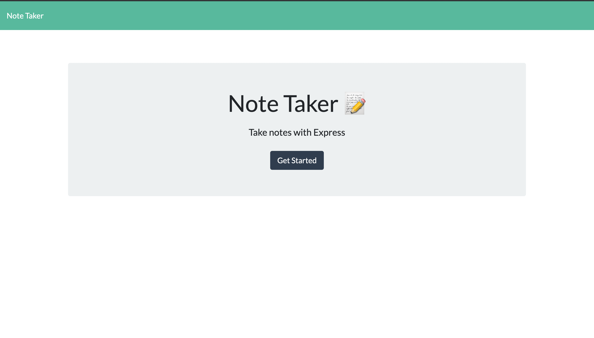
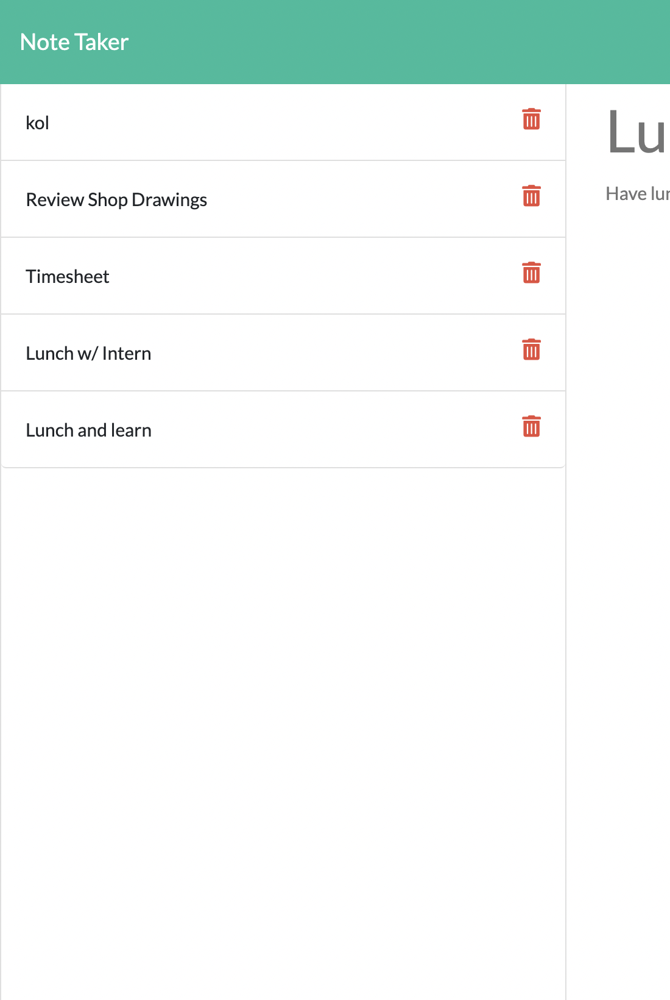
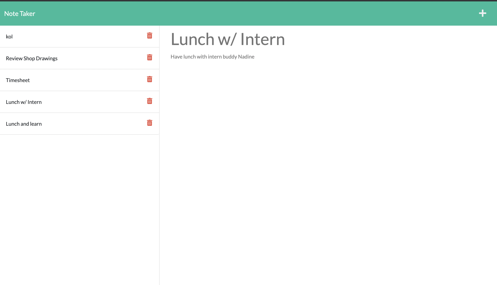
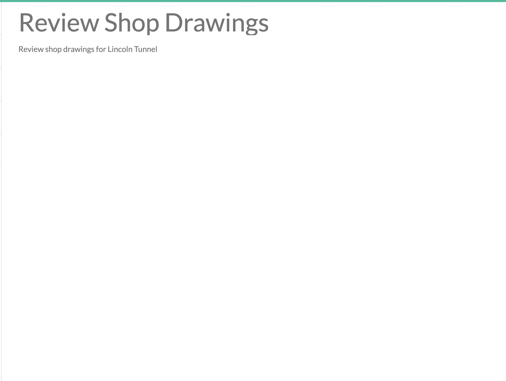

# note-taker
Create an app to write and save notes to organize thoughts and keep track of tasks need to complete.

## Purpose
* Create a note taker using Express.js server that: 
   * Enter a new note title and the note’s text
   * Save notes.
   * Possibly delete notes
   * Click on an existing note in the list in the left-hand column and details of that note appears in the right-hand column.
   * All saved notes appear in the left hand column. 
    
## Built with 
* HTML
* JAVASCRIPT
* CSS
* NODE.JS
* EXPRESS.JS

## Website
https://take-noter.herokuapp.com/ 

## Contribution
Made with ❤️ by Maame

